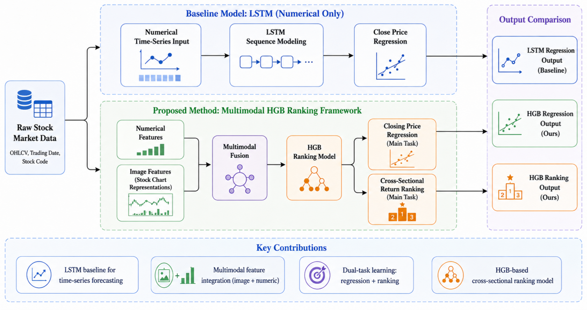
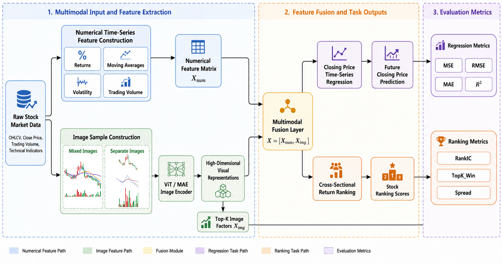
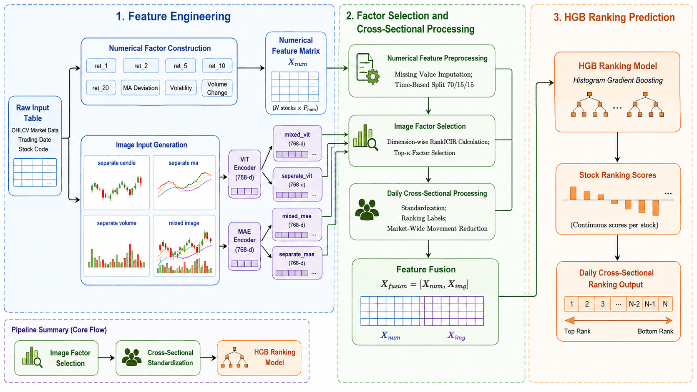

# Multimodal Stock Forecasting

本项目研究数值时序与股票技术图像的多模态融合预测。完整流程覆盖原始行情预处理、混合图/分图生成、ViT/MAE 特征提取、图像因子诊断与筛选、特征级融合，以及收盘价回归和横截面收益排序。

> 仓库提交原始 CSV、源代码、框架示意图和轻量实验结果。实验批量生成的股票图像、NPZ 特征、模型权重、日志与缓存均未提交，可按下述流程重新生成。

## 方法概览

1. 从 OHLCV 数据构造历史收益率、均线偏离、波动率和成交量等数值因子。
2. 将同一股票窗口绘制为混合图或 K 线、成交量、均线分图。
3. 使用 ViT 或 MAE 将图像编码为 768 维表征；三张分图拼接后为 2304 维。
4. 按 `(stock_id, end_date)` 对齐数值与图像样本，并以 `X = [X_num, X_img]` 进行特征级拼接。
5. 逐维计算 IC、RankIC、ICIR 与正 IC 比例，使用稳定性较高的 Top-K 图像因子替代或补充 PCA 特征。
6. 按时间顺序进行 70%/15%/15% 的训练、验证和测试划分，避免未来信息进入训练集。
7. 分别评估收盘价/收益率回归与每日股票横截面排序。

系统级框架设置了数值时序基线与多模态改进路径。基线模型仅接收历史数值序列，通过 LSTM 建模价格随时间的变化，用于检验传统时序信息能够达到的预测水平。多模态路径在数值因子之外引入股票技术图像，通过视觉编码、因子筛选和特征融合补充形态信息，并同时服务于收盘价回归与横截面收益排序。当前仓库报告的最优实现并未要求两个任务共享同一种预测器：回归分支采用 Ridge 校准，排序分支采用 HGB。



## 模型细节

### 多模态特征构建与融合

每个样本由股票代码与窗口结束日期共同确定。数值模态以连续 60 个交易日的 OHLCV 数据为基础，构造多周期收益率、均线偏离、波动率和成交量变化等特征，形成数值矩阵 `X_num`。图像模态使用同一时间窗口生成混合图与分图：混合图在一张图中同时呈现 K 线、均线和成交量；分图则将三类信息分别绘制，以保留更独立的局部结构。

ViT 与 MAE 均输出 768 维单图表征，因此混合图对应 768 维特征，三张分图拼接后对应 2304 维特征。图像特征按照 `(stock_id, end_date)` 与数值样本严格对齐，随后在训练阶段逐维计算 IC、RankIC、ICIR 与正 IC 比例，筛选稳定性较高的 Top-K 图像因子 `X_img`。最终采用特征级拼接得到 `X_fusion = [X_num, X_img]`，不使用交叉注意力或端到端联合微调。



### 回归与横截面排序分支

回归分支以未来收盘价或未来收益率为预测目标。当前最优收盘价方案使用 mixed-MAE 图像特征与数值因子构成融合输入，经标准化后由 Ridge 完成回归，并利用验证集进行线性校准；模型使用 MSE、RMSE、MAE 与 R2 评价误差和拟合程度。较高的收盘价 R2 主要反映价格序列的连续性，因此还需结合朴素基线和收益率结果解释，不能直接等同于投资收益。

排序分支不直接拟合收益率绝对值，而是在每个交易日内部对未来收益进行横截面标准化或排名变换。经过因子筛选的图像特征与数值特征拼接后输入 HGB，模型学习非线性映射并为当日每只股票输出连续得分，再按得分从高到低形成股票序列。排名前 10% 构成 Top-K 组合，排序能力通过 RankIC、TopK_Win 与 Spread 评价。



## 主要结果

### ViT 与 MAE、混合图与分图

同一线性探针和数据切分下，MAE 在混合图与分图两种输入中均获得更低的回归误差。`mixed + MAE` 的 MSE、RMSE、MAE 和 R2 综合最优，因此后续主实验优先使用该特征。

<table align="center">
  <thead>
    <tr>
      <th align="center">图像形式</th>
      <th align="center">编码器</th>
      <th align="center">特征维度</th>
      <th align="center">MSE</th>
      <th align="center">RMSE</th>
      <th align="center">MAE</th>
      <th align="center">R2</th>
    </tr>
  </thead>
  <tbody>
    <tr><td align="center">混合图</td><td align="center">ViT</td><td align="center">768</td><td align="center">0.004484</td><td align="center">0.066966</td><td align="center">0.046624</td><td align="center">-0.007553</td></tr>
    <tr><td align="center"><strong>混合图</strong></td><td align="center"><strong>MAE</strong></td><td align="center">768</td><td align="center"><strong>0.004455</strong></td><td align="center"><strong>0.066748</strong></td><td align="center"><strong>0.046610</strong></td><td align="center"><strong>-0.001001</strong></td></tr>
    <tr><td align="center">分图</td><td align="center">ViT</td><td align="center">2304</td><td align="center">0.004593</td><td align="center">0.067774</td><td align="center">0.047909</td><td align="center">-0.032036</td></tr>
    <tr><td align="center">分图</td><td align="center">MAE</td><td align="center">2304</td><td align="center">0.004546</td><td align="center">0.067420</td><td align="center">0.047473</td><td align="center">-0.021284</td></tr>
  </tbody>
</table>

### 回归结果

<table align="center">
  <thead>
    <tr>
      <th align="left">任务</th>
      <th align="left">模型与特征</th>
      <th align="center">MSE</th>
      <th align="center">MAE</th>
      <th align="center">R2</th>
    </tr>
  </thead>
  <tbody>
    <tr><td>次日收盘价回归</td><td>mixed-MAE 融合 + Ridge 校准</td><td align="center">91.8196</td><td align="center">2.1438</td><td align="center"><strong>0.9926</strong></td></tr>
    <tr><td>次日收益率回归</td><td>数值 + mixed-MAE，Ridge 校准</td><td align="center"><strong>0.003075</strong></td><td align="center"><strong>0.037266</strong></td><td align="center">0.00248</td></tr>
  </tbody>
</table>

收盘价 R2 较高与价格序列强自相关和价格尺度有关，不能直接解释为可交易收益；收益率回归 R2 接近零，说明短期收益点预测仍然困难。因此，论文主线将收盘价回归用于刻画趋势拟合能力，将横截面排序用于衡量选股能力。

### 横截面收益排序

TopK_Win 中的 K 为每日股票池的前 10%，并非固定股票数量。

<table align="center">
  <thead>
    <tr>
      <th align="left">方案</th>
      <th align="center">Return MSE</th>
      <th align="center">RankIC</th>
      <th align="center">TopK_Win</th>
      <th align="center">Spread</th>
    </tr>
  </thead>
  <tbody>
    <tr><td>mixed-MAE + PCA 普通融合</td><td align="center">0.0030807</td><td align="center">-0.0116</td><td align="center">0.4998</td><td align="center">0.00193</td></tr>
    <tr><td>因子筛选 + CatBoost</td><td align="center"><strong>0.0030793</strong></td><td align="center">0.0054</td><td align="center">0.4902</td><td align="center">0.00354</td></tr>
    <tr><td><strong>因子筛选 + 横截面标准化 HGB</strong></td><td align="center">—</td><td align="center"><strong>0.0301</strong></td><td align="center"><strong>0.5263</strong></td><td align="center">0.00503</td></tr>
    <tr><td>因子筛选 + 横截面标准化 CatBoost</td><td align="center">—</td><td align="center">0.0196</td><td align="center">0.5197</td><td align="center"><strong>0.00873</strong></td></tr>
  </tbody>
</table>

HGB 方案取得最高 RankIC 和 TopK_Win，是主排序模型；CatBoost 获得最高 Spread。表中的 `—` 表示排序方案不输出收益率点预测，因此不报告 Return MSE，并非实验缺失。

## 仓库结构

```text
.
|-- code/           # 制图、特征提取、诊断、回归与排序代码
|-- data/           # 唯一提交的数据：原始行情 CSV
|-- docs/figures/   # README 使用的三张框架示意图
|-- results/        # 轻量 JSON 实验结果，不含图片和 NPZ
|-- requirements.txt
`-- README.md
```

核心脚本：

| 阶段 | 文件 |
|---|---|
| 混合图与分图生成 | `code/aligned_stock_figures.py`、`code/mix_generate_figure.ipynb`、`code/generate_separate_figure.ipynb` |
| ViT/MAE 特征提取 | `code/extract_aligned_features.py`、`code/vit_features_npz.ipynb`、`code/mae_features_npz.ipynb` |
| 四类图像特征比较 | `code/compare_aligned_features.py` |
| 三层评估 | `code/three_layer_evaluation.py` |
| 因子诊断与回测 | `code/factor_diagnostics_backtest.py` |
| 排序与融合改进 | `code/iterative_improvement.py`、`code/ranker_auc_search.py` |
| 回归与模型调参 | `code/multi_metric_model_tuning.py`、`code/gpu_auc_search.py`、`code/focused_auc_horizon_search.py` |

## 环境安装

建议使用 Python 3.10 或 3.11。GPU 实验需要与 CUDA 环境匹配的 PyTorch、XGBoost 或 CatBoost。

```bash
python -m pip install -U pip setuptools wheel
pip install -r requirements.txt
```

## 复现实验

以下命令默认在仓库根目录执行，生成内容统一写入未被 Git 跟踪的 `artifacts/`。

### 1. 生成对齐的混合图和分图

```bash
python code/aligned_stock_figures.py \
  --csv data/日个股数据2.0.csv \
  --out-root artifacts/aligned_figures \
  --window 60 --horizon 7 --image-size 224 --workers 8
```

### 2. 提取四类图像特征

```bash
python code/extract_aligned_features.py --fig-root artifacts/aligned_figures --out-root artifacts/aligned_features --source mixed --encoder vit
python code/extract_aligned_features.py --fig-root artifacts/aligned_figures --out-root artifacts/aligned_features --source mixed --encoder mae
python code/extract_aligned_features.py --fig-root artifacts/aligned_figures --out-root artifacts/aligned_features --source separate --encoder vit
python code/extract_aligned_features.py --fig-root artifacts/aligned_figures --out-root artifacts/aligned_features --source separate --encoder mae --aggregate concat
```

### 3. 比较 ViT/MAE 与混合图/分图

```bash
python code/compare_aligned_features.py \
  --feature-root artifacts/aligned_features \
  --out artifacts/aligned_features/comparison_results.json
```

### 4. 因子诊断、回测与三层评估

```bash
python code/factor_diagnostics_backtest.py \
  --feature-dirs artifacts/aligned_features/mixed_vit,artifacts/aligned_features/mixed_mae,artifacts/aligned_features/separate_vit,artifacts/aligned_features/separate_mae \
  --top-ks 32,64,128 --out-dir artifacts/factor_diagnostics

python code/three_layer_evaluation.py \
  --feature-root artifacts/aligned_features \
  --csv data/日个股数据2.0.csv \
  --out-dir artifacts/three_layer_eval
```

### 5. 最新排序搜索

`ranker_auc_search.py` 支持环境变量覆盖路径：

```bash
export STOCK_REPO_ROOT="$PWD"
export STOCK_ARTIFACT_ROOT="$PWD/artifacts"
export STOCK_FEATURE_ROOT="$PWD/artifacts/aligned_features"
export STOCK_DIAGNOSTICS="$PWD/artifacts/factor_diagnostics/factor_diagnostics_all.csv"

python code/ranker_auc_search.py
```

## 结果说明

完整轻量结果保存在 [`results/`](results/)。这些文件记录了实验参数、验证集和测试集指标，但不包含生成图片、逐股票 NPZ 特征或模型权重。金融预测结果仅用于研究，不构成投资建议。
